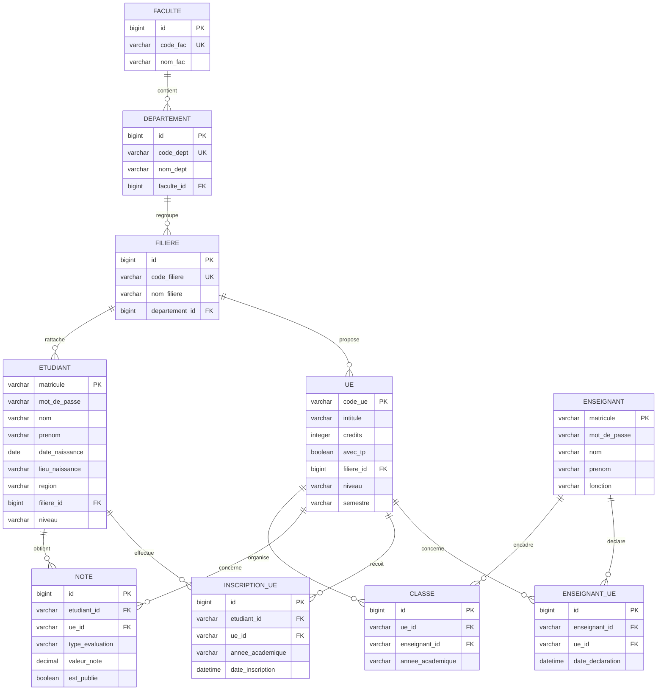

# Modele relationnel du projet EduManage

## 1. Presentation

Le projet gere les utilisateurs academiques, les formations, les unites d'enseignement, les habilitations des enseignants, les inscriptions des etudiants et leurs notes.

L'authentification applicative utilise directement les tables `accounts_etudiant` et `accounts_enseignant`, a partir du matricule et du mot de passe stocke dans `mot_de_passe`.

## 2. Entites et relations

### Faculte

Une faculte regroupe plusieurs departements.

- Une `Faculte` possede zero ou plusieurs `Departement`.
- Un `Departement` appartient a une seule `Faculte`.

### Departement

Un departement appartient a une faculte et regroupe plusieurs filieres.

- Un `Departement` possede zero ou plusieurs `Filiere`.
- Une `Filiere` appartient a un seul `Departement`.

### Filiere

Une filiere regroupe les UE et les etudiants qui lui sont rattaches.

- Une `Filiere` possede zero ou plusieurs `UE`.
- Une `UE` appartient a une seule `Filiere`.
- Une `Filiere` possede zero ou plusieurs `Etudiant`.
- Un `Etudiant` peut etre rattache a zero ou une `Filiere`.

### Etudiant

Un etudiant selectionne des UE et recoit des notes.

- Un `Etudiant` possede zero ou plusieurs `InscriptionUE`.
- Une `InscriptionUE` appartient a un seul `Etudiant`.
- Un `Etudiant` possede zero ou plusieurs `Note`.
- Une `Note` appartient a un seul `Etudiant`.

### Enseignant

Un enseignant peut etre habilite a dispenser plusieurs UE.

- Un `Enseignant` possede zero ou plusieurs `EnseignantUE`.
- Une `EnseignantUE` appartient a un seul `Enseignant`.
- Un `Enseignant` peut etre responsable de zero ou plusieurs `Classe`.
- Une `Classe` appartient a un seul `Enseignant`.

### UE

Une UE appartient a une filiere et peut etre dispensee par plusieurs enseignants.

- Une `UE` possede zero ou plusieurs `EnseignantUE`.
- Une `UE` possede zero ou plusieurs `InscriptionUE`.
- Une `UE` possede zero ou plusieurs `Note`.
- Une `UE` possede zero ou plusieurs `Classe`.

### Classe

Une classe associe une UE a un enseignant pour une annee academique.

- Une classe concerne une seule `UE` et un seul `Enseignant`.
- Le couple `(ue, annee_academique)` est unique.

### InscriptionUE

Cette table associative enregistre le choix d'une UE par un etudiant pour une annee academique.

- Elle relie `Etudiant` et `UE`.
- Le couple `(etudiant, ue, annee_academique)` est unique.
- Une inscription est supprimee si son etudiant ou son UE est supprime.

### Note

Une note correspond a un etudiant, une UE et un type d'evaluation.

- Les types d'evaluation sont `CC`, `TP`, `SN` et `RAT`.
- La note est comprise entre 0 et 20.
- Le couple `(etudiant, ue, type_evaluation)` est unique.
- Une note peut etre publiee ou non avec `est_publie`.

## 3. Diagramme relationnel

## 4. Liste des tables et champs

### `academic_faculte`

| Champ | Type Django / SQL | Parametres | Cle / contrainte |
|---|---|---|---|
| `id` | `BigAutoField` / `INTEGER` | Auto-incremente | Cle primaire |
| `code_fac` | `CharField` / `VARCHAR(20)` | Obligatoire, unique | Unique |
| `nom_fac` | `CharField` / `VARCHAR(150)` | Obligatoire | - |

### `academic_departement`

| Champ | Type Django / SQL | Parametres | Cle / contrainte |
|---|---|---|---|
| `id` | `BigAutoField` / `INTEGER` | Auto-incremente | Cle primaire |
| `code_dept` | `CharField` / `VARCHAR(20)` | Obligatoire, unique | Unique |
| `nom_dept` | `CharField` / `VARCHAR(150)` | Obligatoire | - |
| `faculte_id` | `ForeignKey` / `INTEGER` | Obligatoire, suppression en cascade | FK vers `academic_faculte(id)` |

### `academic_filiere`

| Champ | Type Django / SQL | Parametres | Cle / contrainte |
|---|---|---|---|
| `id` | `BigAutoField` / `INTEGER` | Auto-incremente | Cle primaire |
| `code_filiere` | `CharField` / `VARCHAR(20)` | Obligatoire, unique | Unique |
| `nom_filiere` | `CharField` / `VARCHAR(150)` | Obligatoire | - |
| `departement_id` | `ForeignKey` / `INTEGER` | Facultatif, suppression en cascade | FK vers `academic_departement(id)` |

### `accounts_etudiant`

| Champ | Type Django / SQL | Parametres | Cle / contrainte |
|---|---|---|---|
| `matricule` | `CharField` / `VARCHAR(50)` | Obligatoire | Cle primaire |
| `mot_de_passe` | `CharField` / `VARCHAR(128)` | Facultatif, valeur par defaut `''` | Mot de passe hache |
| `nom` | `CharField` / `VARCHAR(100)` | Obligatoire | - |
| `prenom` | `CharField` / `VARCHAR(100)` | Obligatoire | - |
| `date_naissance` | `DateField` / `DATE` | Obligatoire | - |
| `lieu_naissance` | `CharField` / `VARCHAR(100)` | Obligatoire | - |
| `region` | `CharField` / `VARCHAR(20)` | Obligatoire, choix Region | - |
| `filiere_id` | `ForeignKey` / `INTEGER` | Facultatif, suppression en cascade | FK vers `academic_filiere(id)` |
| `niveau` | `CharField` / `VARCHAR(2)` | Obligatoire, choix L1, L2, L3, M1, M2 | - |

### `accounts_enseignant`

| Champ | Type Django / SQL | Parametres | Cle / contrainte |
|---|---|---|---|
| `matricule` | `CharField` / `VARCHAR(50)` | Obligatoire | Cle primaire |
| `mot_de_passe` | `CharField` / `VARCHAR(128)` | Facultatif, valeur par defaut `''` | Mot de passe hache |
| `nom` | `CharField` / `VARCHAR(100)` | Obligatoire | - |
| `prenom` | `CharField` / `VARCHAR(100)` | Obligatoire | - |
| `fonction` | `CharField` / `VARCHAR(100)` | Obligatoire | - |

### `academic_ue`

| Champ | Type Django / SQL | Parametres | Cle / contrainte |
|---|---|---|---|
| `code_ue` | `CharField` / `VARCHAR(20)` | Obligatoire | Cle primaire |
| `intitule` | `CharField` / `VARCHAR(150)` | Obligatoire | - |
| `credits` | `PositiveIntegerField` / `INTEGER` | Obligatoire, valeur positive ou nulle | - |
| `avec_tp` | `BooleanField` / `BOOLEAN` | Obligatoire, valeur par defaut `False` | - |
| `filiere_id` | `ForeignKey` / `INTEGER` | Obligatoire, suppression en cascade | FK vers `academic_filiere(id)` |
| `niveau` | `CharField` / `VARCHAR(2)` | Obligatoire, choix L1, L2, L3, M1, M2 | - |
| `semestre` | `CharField` / `VARCHAR(2)` | Obligatoire, choix S1 ou S2 | - |

### `academic_enseignantue`

| Champ | Type Django / SQL | Parametres | Cle / contrainte |
|---|---|---|---|
| `id` | `BigAutoField` / `INTEGER` | Auto-incremente | Cle primaire |
| `enseignant_id` | `ForeignKey` / `VARCHAR(50)` | Obligatoire, suppression en cascade | FK vers `accounts_enseignant(matricule)` |
| `ue_id` | `ForeignKey` / `VARCHAR(20)` | Obligatoire, suppression en cascade | FK vers `academic_ue(code_ue)` |
| `date_declaration` | `DateTimeField` / `DATETIME` | Automatique a la creation | - |

Contrainte supplementaire: `(enseignant_id, ue_id)` est unique.

### `pedagogy_inscriptionue`

| Champ | Type Django / SQL | Parametres | Cle / contrainte |
|---|---|---|---|
| `id` | `BigAutoField` / `INTEGER` | Auto-incremente | Cle primaire |
| `etudiant_id` | `ForeignKey` / `VARCHAR(50)` | Obligatoire, suppression en cascade | FK vers `accounts_etudiant(matricule)` |
| `ue_id` | `ForeignKey` / `VARCHAR(20)` | Obligatoire, suppression en cascade | FK vers `academic_ue(code_ue)` |
| `annee_academique` | `CharField` / `VARCHAR(20)` | Obligatoire, defaut `2025-2026` | - |
| `date_inscription` | `DateTimeField` / `DATETIME` | Automatique a la creation | - |

Contrainte supplementaire: `(etudiant_id, ue_id, annee_academique)` est unique.

### `pedagogy_classe`

| Champ | Type Django / SQL | Parametres | Cle / contrainte |
|---|---|---|---|
| `id` | `BigAutoField` / `INTEGER` | Auto-incremente | Cle primaire |
| `ue_id` | `ForeignKey` / `VARCHAR(20)` | Obligatoire, suppression en cascade | FK vers `academic_ue(code_ue)` |
| `enseignant_id` | `ForeignKey` / `VARCHAR(50)` | Obligatoire, suppression en cascade | FK vers `accounts_enseignant(matricule)` |
| `annee_academique` | `CharField` / `VARCHAR(20)` | Obligatoire, defaut `2025-2026` | - |

Contrainte supplementaire: `(ue_id, annee_academique)` est unique.

### `pedagogy_note`

| Champ | Type Django / SQL | Parametres | Cle / contrainte |
|---|---|---|---|
| `id` | `BigAutoField` / `INTEGER` | Auto-incremente | Cle primaire |
| `etudiant_id` | `ForeignKey` / `VARCHAR(50)` | Obligatoire, suppression en cascade | FK vers `accounts_etudiant(matricule)` |
| `ue_id` | `ForeignKey` / `VARCHAR(20)` | Obligatoire, suppression en cascade | FK vers `academic_ue(code_ue)` |
| `type_evaluation` | `CharField` / `VARCHAR(3)` | Obligatoire, choix CC, TP, SN, RAT | - |
| `valeur_note` | `DecimalField` / `DECIMAL(4,2)` | Facultatif, entre 0 et 20 | - |
| `est_publie` | `BooleanField` / `BOOLEAN` | Obligatoire, defaut `False` | - |

Contrainte supplementaire: `(etudiant_id, ue_id, type_evaluation)` est unique.

## 5. Valeurs enumerees

- `Niveau`: `L1`, `L2`, `L3`, `M1`, `M2`.
- `Semestre`: `S1`, `S2`.
- `TypeEvaluation`: `CC`, `TP`, `SN`, `RAT`.
- `Region`: `ADAMAOUA`, `CENTRE`, `EST`, `EXTREME_NORD`, `LITTORAL`, `NORD`, `NORD_OUEST`, `OUEST`, `SUD`, `SUD_OUEST`.

## 6. Regles importantes

1. Un etudiant doit selectionner exactement 7 UE avant d'acceder a son tableau de bord.
2. Les UE deja selectionnees par un etudiant ne doivent plus etre modifiees par le parcours de selection.
3. Un enseignant ne peut gerer les notes que pour une UE declaree dans `academic_enseignantue`.
4. Une note n'est visible par l'etudiant que lorsque `est_publie` vaut `True`.
5. Les suppressions des entites parentes utilisent `on_delete=models.CASCADE` selon les relations decrites ci-dessus.
